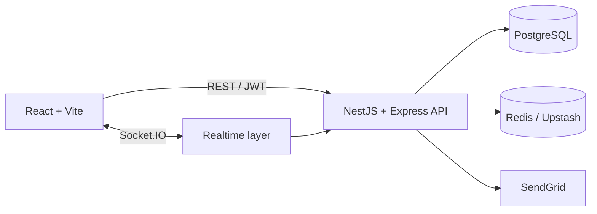

# FiFB

FiFB is a fitness platform built with NestJS (incrementally migrating from Express), PostgreSQL, Redis, Socket.IO, React, Vite, and Tailwind CSS.
This upgrade intentionally excludes chatbot and AI features.

## Features

- JWT authentication, email verification, roles, trainers, certificates, reviews, and connections
- Exercise library, taxonomy, favorites, and workout plans
- Workout tracking with set/rep/weight logs, volume, streaks, and exercise progression
- Persistent trainer-user chat with REST fallback and Socket.IO events
- Real-time notifications and unread badge
- Redis/Upstash response caching and distributed rate limiting
- Docker, Render blueprint, and GitHub Actions workflows

## Architecture



The application code lives in:

```text
server/
client/
```

The backend is migrating module by module to NestJS 11 with TypeScript. `ExercisesModule` owns
`/api/exercises` and `/api/admin/exercises`; `ExerciseTaxonomyModule` owns `/api/exercise-taxonomy`.
Other modules still use Express. Nest uses the existing
Express 4 application through `ExpressAdapter`, preserving legacy middleware and request validation.
Controllers and services use Nest dependency injection; the existing PostgreSQL repository is registered
as a provider. Shared guards, Zod pipes, exception handling and cache interceptors preserve the API contract.

The backend keeps the existing module pattern:

```text
controller -> service -> repository -> PostgreSQL
                  |
                  +-> Redis / Socket.IO
```

## Local Setup

Requirements: Node.js 20+, PostgreSQL, and optionally Redis.

```powershell
cd server
npm.cmd install
Copy-Item .env.example .env

cd ..\client
npm.cmd install
Copy-Item .env.example .env
```

Edit `server/.env`:

- `DATABASE_URL`
- `JWT_ACCESS_SECRET`
- `JWT_REFRESH_SECRET`
- `CORS_ORIGIN` (`http://localhost:5173,http://localhost:3000` for local native + Docker Compose frontend)
- SendGrid values if using email verification/password reset
- Redis or Upstash values if `REDIS_DISABLED=false`

PowerShell blocks `npm.ps1` on this machine, so use `npm.cmd`.
The existing base schema is documented in `Document/DatabaseSQL.txt`.

Apply the non-AI v2 additions:

```powershell
cd server
npm.cmd run migrate:v2 -- --dry-run
npm.cmd run migrate:v2
npm.cmd run migrate:indexes
```

Run both applications:

```powershell
# Terminal 1
cd server
npm.cmd run dev

# Terminal 2
cd client
npm.cmd run dev
```

- Native frontend: `http://localhost:5173`
- Docker Compose frontend: `http://localhost:3000`
- Backend API: `http://localhost:4000/api` by default, or the port configured by `server/.env` `PORT`
- Health: `http://localhost:4000/api/health`

## New API Endpoints

Workout sessions:

- `POST /api/workout-sessions`
- `GET /api/workout-sessions`
- `GET /api/workout-sessions/stats`
- `GET /api/workout-sessions/progression/:exerciseId`
- `GET /api/workout-sessions/:id`
- `PATCH /api/workout-sessions/:id`
- `POST /api/workout-sessions/:id/logs`

Trainer-user chat:

- `GET /api/chat/unread`
- `GET /api/chat/:connectionId/messages`
- `POST /api/chat/:connectionId/messages`
- `PATCH /api/chat/:connectionId/read`

Socket events:

- `notification:new`, `notification:count`
- `chat:join`, `chat:send`, `chat:receive`, `chat:typing`, `chat:read`

All existing API response formats remain unchanged.

## Docker

```powershell
docker compose up --build
```

This starts the API, Vite client, and Redis. Build the production API image independently with:

```powershell
docker build -t fifb-api .\server
docker run --env-file .\server\.env -p 4000:4000 fifb-api
```

## Quality Checks

```powershell
cd server
npm.cmd run lint
npm.cmd run build
npm.cmd test
npm.cmd run format:check

cd ..\client
npm.cmd run lint
npm.cmd run build
npm.cmd run format:check
```

For production, run `npm run build` then `npm start` in `server/`. `npm run dev` runs TypeScript
with automatic restarts. Docker builds the compiled backend; rebuild with `docker compose up --build`
after source changes. Existing database/import scripts continue to run directly with Node.

GitHub Actions runs server lint/build/tests and client lint/build. The Render Blueprint deploys the
`main` branch automatically after those checks pass. Telegram notifications optionally use
`TELEGRAM_BOT_TOKEN` and `TELEGRAM_CHAT_ID`.
